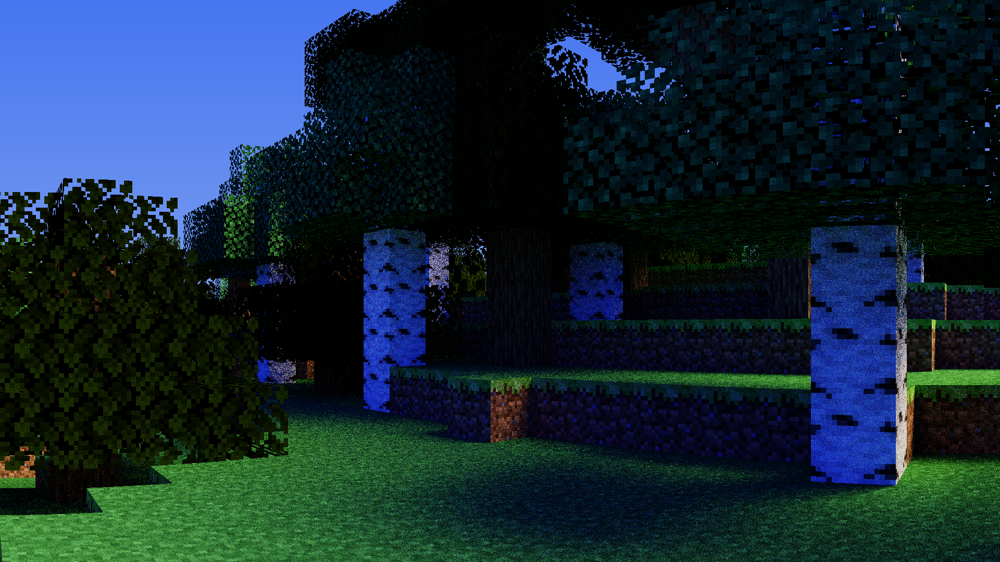
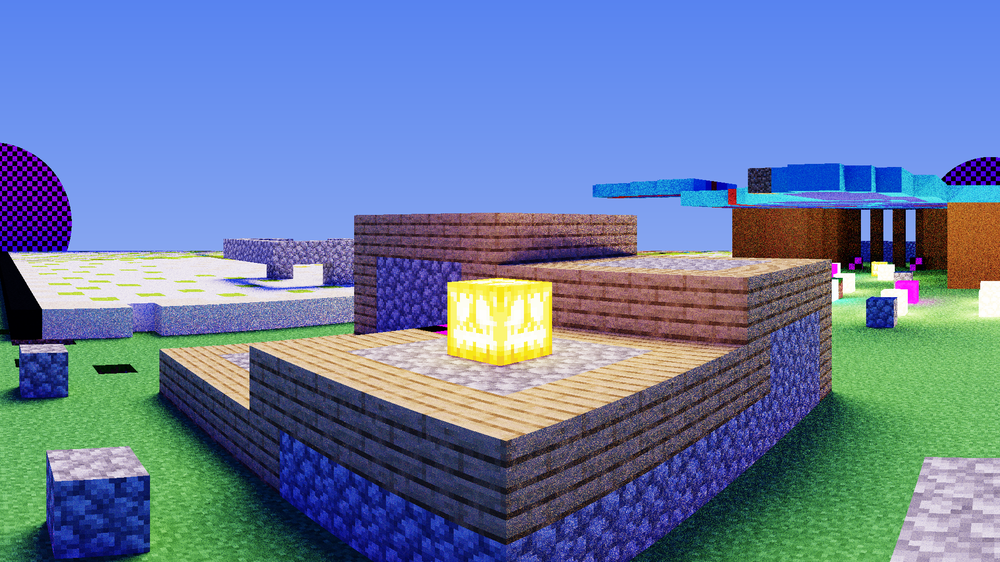

# MinePhoto

MinePhoto is a library for Mineflayer that produces ray traced images on the CPU.

>[!IMPORTANT]
>While it's designed to be fast, very little thought has gone into RAM consumption.
>I would recommend 16GB at minimum. It's also very greedy with resources and by default will use all available threads.

### Usage

Once it's installed you can add support to an existing mineflayer project:

```javascript

const { Camera } = require('mine-photo');

bot.once("spawn", async ()=>{

    const camera = new Camera(bot); // Create a camera

    await camera.scan(128, 64, 128); // Preload blocks around the bot (very slow)

    // Configure camera settings (optional)
    camera.resize(640, 480);
    camera.samplesPerPixel = 32;
    camera.maxBounces = 3;
    camera.fov = 90;

    await camera.render("image.png"); // Render an image and save it to a file
});

```

You can find a full example [here](bot.js).

### Examples


